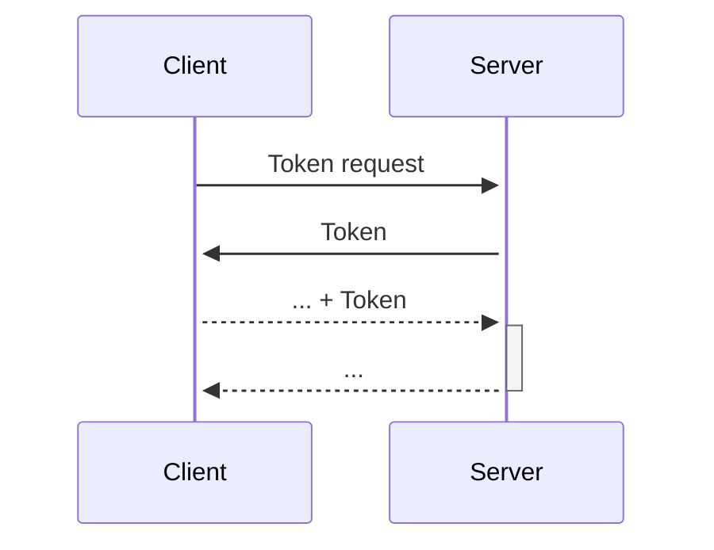
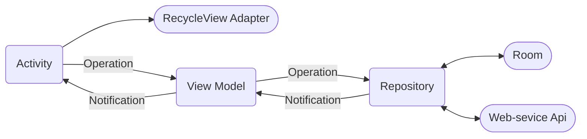
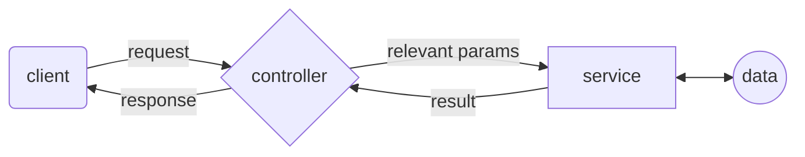

First, go see our wiki


# Social Media - FooBar
Foobar is a social media application inspired by platforms like Facebook. It provides both a web client and an Android app for users to connect and share updates. This README file provides an overview of the project, installation instructions, and details about its components.

## Getting Started

- **When running the server, if the MongoDB is empty, it will insert automatically the default posts and users. If there is any problem, you can find the posts.json, and users.json on ./server**
- Notice that for now, you can find the Android App in a different [repository](https://github.com/Shahar2612/ProjectPart2-Android.git).

### Dependencies

This project requires the following dependencies:

* [Node.js](https://nodejs.org/en/) - JavaScript runtime environment
* [npm](https://www.npmjs.com/) - Package manager for JavaScript
* [React](https://reactjs.org/) - JavaScript library for building user interfaces
* [MongoDB](https://www.mongodb.com/) - NoSQL database

### Installation

Clone the repository: 
```bash
git clone https://github.com/Shahar2612/ProjectPart2-Web.git
```

Download the necessary dependencies for both the web-client and the server, by running 

```
npm i --force
```
### Executing The Program

To run the Program, navigate to the server directory, and run the following command:

```bash
npm start
```

if you are using mac, run the following command:

```bash
npm run yaara
```

then open [http://localhost:8080](http://localhost:8080) 
to view it in your browser.

To run the android client, open the android studio app on the android client folder. make sure that your android sdk has a correct config, and run it from there (of course you can run it both on an emulator, a phisycal device).

## Design

### Web Client workflow

The client is built on React. It is responsible for displaying the user interface, and communicating with the server.

There is one thing to note about the client's workflow. When a user logs in, the server returns a JWT token. The client then stores this token in local storage, and uses this token to authenticate the user in every request to the server. When the user logs out, the client deletes the token from the local storage.



## What can you do?
First, you need to create a new account, then you can log in and use FoBar! 
* You can add, edit and delete posts only if the posts is yours.
* You can add, edit and delete comments only if the comments is yours. 
* You can edit your user name and picture if you click on the edit img in the up menu (next to your picture in the up menu).
* You can log out or delete your account if you click on your picture in the up menu.
* You can change light mood to dark mood if you click on the moon img.
* You can like and unlike a post, etc.
* You can click on the name or picture in each post and get to the personal profile page of the author of the post, where you can also send a friend request or if you are already friends - see the user posts, friends list and an option to delete the user from your friend list.
* You can see your friends requests list if you click on the grup img in the middel of the up menu. There you can also approve or decline the requests.

### Android Client workflow

Our Android client mirrors the web client's functionality, distinguished by its refined design employing the MVVM architecture.
The app utilizing a local Room database. This  plays a crucial role in enhancing the user experience by providing seamless access to data even in offline scenarios. 



## Server API

The server is built on Node.js and Express.js. It's responsible for handling the client's requests, and communicating with the database.

The server exposes it's functionality through a REST API. Here's a list of the API's endpoints:

| Endpoint | Method | Description |
|----------|--------|-------------|
| /api/token | POST | Returns a JWT token for the user |
| /api/users | POST | Registers a new user |
| /api/users/:email | GET | Returns the user's information |
| /api/users/:email | PATCH | updates the user's information |
| /api/users/:email | DELETE | Deletes the user |
| /api/users/:email/friends | GET | Returns the user friends |
| /api/users/:email/friends | POST | Send a new friend request to the user |
| /api/users/:email/friends/:fid | GET | Accept a friend request |
| /api/users/:email/friends/:fid | DELETE | Deletes a user from the friends list |
| /api/users/:email/friendRec/:fid | DELETE | Decline friend request |
| /api/users/:email/posts | GET | Returns the user's posts|
| /api/users/:email/posts | POST | Creates new post|
| /api/users/:email/posts/:fid | DELETE | Deletes a post|
| /api/users/:email/posts/:fid | POST | Creates a new comment|
| /api/users/:email/posts/:fid | PATCH | Updates a post|
| /api/users/:email/comments/:cid | GET | Returns the comment's information|
| /api/users/:email/posts/:pid/:cid | DELETE | Deletes a comment|
| /api/users/:email/posts/:pid/:cid | PATCH | Updates a comment|
| /api/posts | GET | Returns 25 posts|

**Note:** besides the first two endpoints, all the other endpoints require the user to be authenticated. The authentication is done by sending the JWT token in the request's header.

## Server Architecture

The server is designed using the MVCS architecture (except for the view, since there is no user interface). Here's a simple diagram of the server's architecture:



### Notes

- According to the assignment instructions, when a user logs in and reaches the main page, the application displays up to 25 posts. Five of these posts are from users who are not friends with the logged-in user, while the remaining posts are from friends of the user. This ensures a diverse and dynamic feed for a better user experience.

- The android client supports english, textual messages only (only ascii charachters)

- The posts date times show up with times from the GMT+2 time zone

## Authors
[Shahar Chen](https://github.com/Shahar2612)  
[Yaara Sirkis](https://github.com/YaaraSirkis)  
[Meitar Teper](https://github.com/MeitarTeper)

## Screenshots Exampels
#### Login


#### Registration


#### Feed


#### Profile | Friend Request


#### Accept Friend Request


